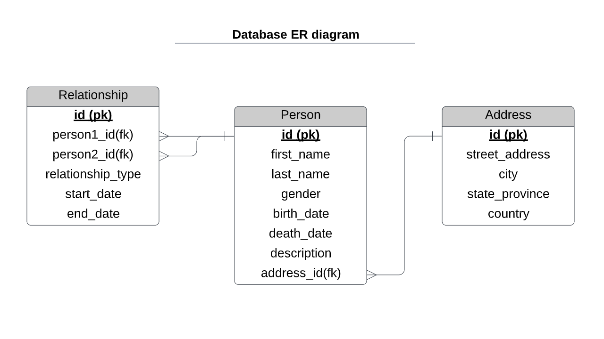
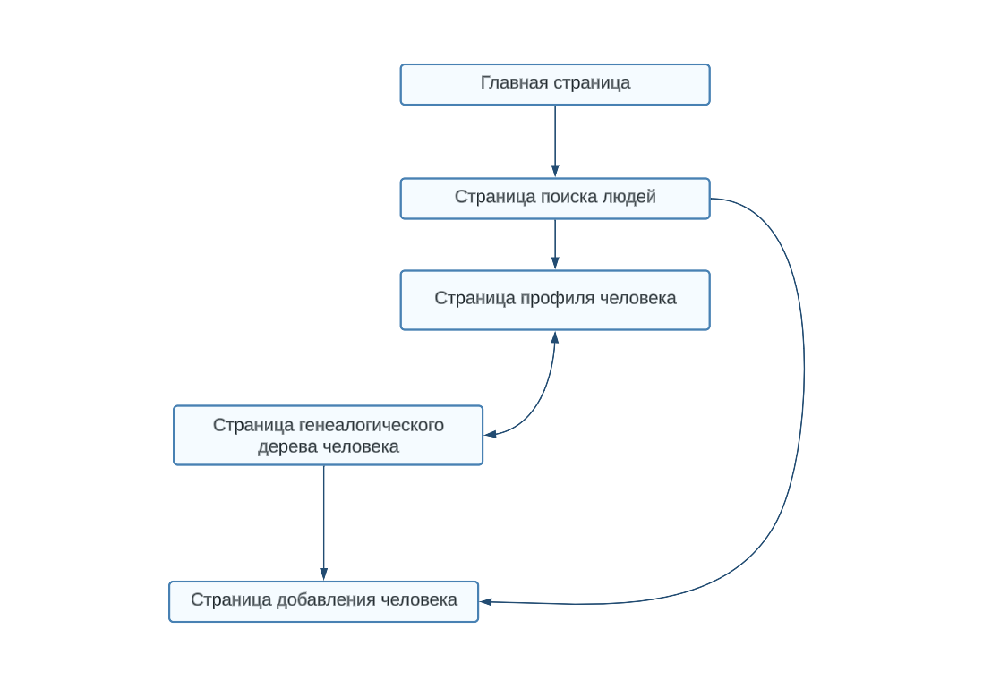

Система генеалогической информации
========
База данных
-
*****

Описание страниц
-
*****

*****
С любой страницы можно перейти на главную.

### Главная страница
* Кнопки для перехода на другие страницы в приложении.
* Краткий обзор приложения и его возможностей.
### Страница поиска людей
* Панель поиска с различными фильтрами для поиска людей в базе данных.
* Список результатов, отображающий основную информацию о каждом человеке, найденном в результате поиска.
* Возможность просмотра страницы профиля каждого человека.
### Страница профиля человека
* Формы ввода для редактирования или обновления информации о человеке.
* Кнопки для перехода к связанным людям в генеалогическом древе человека (например, к родителям, детям, братьям и сестрам).
* Кнопки для перехода к дереву потомков/предков человека
### Страница генеалогического дерева человека
* Интерактивная диаграмма генеалогического древа с узлами, представляющими каждого человека в генеалогическом древе.
* Кнопки для навигации по генеалогическому дереву и раскрытия/свертывания ветвей.
* Возможность просмотра страницы профиля каждого человека.
### Страница добавления человека
* Формы ввода для добавления нового человека в базу данных, включая его имя, даты рождения/смерти, отношения и другую соответствующую информацию.
* Кнопка для сохранения нового человека в базе данных.
### Хронология
* Хронология жизни выбранного человека человека.
* Кнопки для навигации по временной шкале и просмотра более подробной информации.
* Возможность просмотра страницы профиля каждого человека.
### Статистика
* Различные диаграммы или графики, отображающие статистику о данных в базе данных.
* Возможность фильтровать статистику по различным критериям.
* Краткий обзор представленной статистики.

Сценарии пользования
=
***
### Добавление человека
1. Перейти на страницу «Добавить человека».
2. Заполнить форму информацией о человеке.
3. Указать отношения (если есть)
4. Сохранить информацию и перенаправиться на страницу профиля человека.
### Поиск человека
1. Перейти на главную страницу приложения.
2. Нажать кнопку, чтобы перейти на страницу поиска людей.
3. Ввести поисковый запрос в строку поиска и нажать кнопку поиска.
### Просмотр дерева
1. Перейти на страницу «Семейное древо».
2. Выбрать человека, для которого хотим просмотреть дерево.
3. Выбрать тип дерева, которое хотим просмотреть (предки, потомки или полное семейное дерево).
### Просмотр хронологии
1. Перейти на страницу «Хронология».
2. Выбрать человека, для которого он хочет просмотреть хронологию.
3. Выбрать любые соответствующие фильтры.
4. Просмотреть хронологию на странице.
### Просмотр статистики
1. Перейти на страницу «Статистика».
2. Выбрать тип статистики, которую хотим просмотреть.
3. Выбрать любые соответствующие фильтры.
4. Просмотреть статистику на странице.