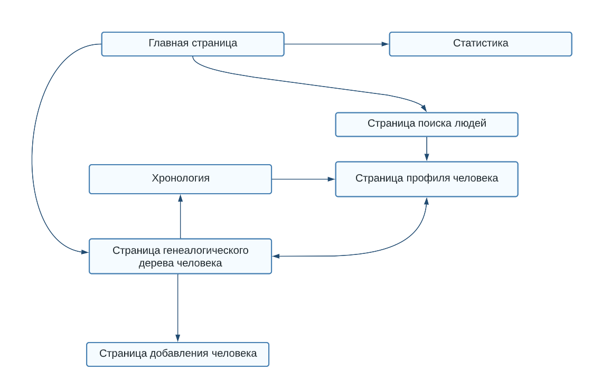

Система генеалогической информации
========
База данных
-
*****

Описание страниц
-
*****

*****
С любой страницы можно перейти на главную.

### Главная страница
* Кнопки для перехода на другие страницы в приложении.
* Краткий обзор приложения и его возможностей.
### Страница поиска людей
* Панель поиска с различными фильтрами для поиска людей в базе данных.
* Список результатов, отображающий основную информацию о каждом человеке, найденном в результате поиска.
* Возможность просмотра страницы профиля каждого человека.
### Страница профиля человека
* Формы ввода для редактирования или обновления информации о человеке.
* Кнопки для перехода к связанным людям в генеалогическом древе человека (например, к родителям, детям, братьям и сестрам).
* Кнопки для перехода к дереву потомков/предков человека
### Страница генеалогического дерева человека
* Интерактивная диаграмма генеалогического древа с узлами, представляющими каждого человека в генеалогическом древе.
* Кнопки для навигации по генеалогическому дереву и раскрытия/свертывания ветвей.
* Возможность просмотра страницы профиля каждого человека.
### Страница добавления человека
* Формы ввода для добавления нового человека в базу данных, включая его имя, даты рождения/смерти, отношения и другую соответствующую информацию.
* Кнопка для сохранения нового человека в базе данных.
### Хронология
* Хронология жизни выбранного человека человека.
* Кнопки для навигации по временной шкале и просмотра более подробной информации.
* Возможность просмотра страницы профиля каждого человека.
### Статистика
* Различные диаграммы или графики, отображающие статистику о данных в базе данных.
* Возможность фильтровать статистику по различным критериям.
* Краткий обзор представленной статистики.

Сценарии пользования
=
***
### Добавление человека
1. Пользователь переходит на страницу «Добавить человека».
2. Пользователь заполняет форму информацией о человеке.
3. Пользователь указывает отношения (если есть)
4. Пользователь сохраняет информацию и перенаправляется на страницу профиля человека.
### Поиск человека
1. Пользователь переходит на главную страницу приложения.
2. Пользователь нажимает кнопку, чтобы перейти на страницу поиска людей.
3. Пользователь вводит поисковый запрос в строку поиска и нажимает кнопку поиска.
### Просмотр дерева
1. Пользователь переходит на страницу «Семейное древо».
2. Пользователь выбирает человека, для которого он хочет просмотреть дерево.
3. Пользователь выбирает тип дерева, которое он хочет просмотреть (предки, потомки или полное семейное дерево).
### Просмотр хронологии
1. Пользователь переходит на страницу «Хронология».
2. Пользователь выбирает человека, для которого он хочет просмотреть хронологию.
3. Пользователь выбирает любые соответствующие фильтры.
4. Пользователь просматривает хронологию на странице.
### Просмотр статистики
1. Пользователь переходит на страницу «Статистика».
2. Пользователь выбирает тип статистики, которую он хочет просмотреть.
3. Пользователь выбирает любые соответствующие фильтры.
4. Пользователь просматривает статистику на странице.